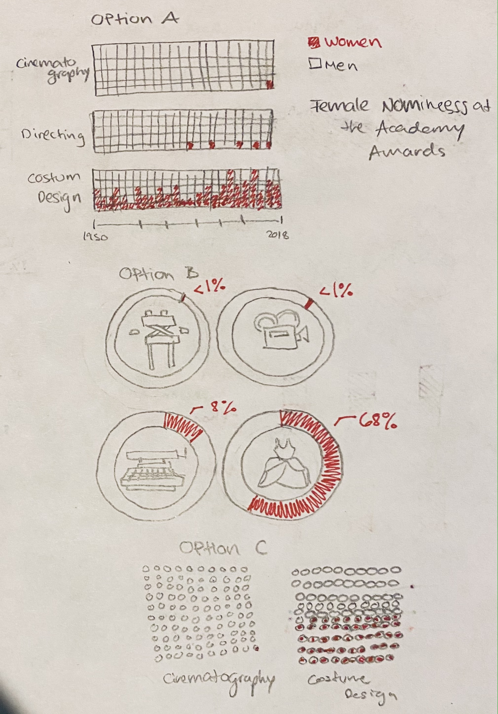

# The Gender Gap in the Academy Awards

For this third assigment, I want to focus in the gender ratio for the nominees of the Academy Awards in major cathegories.

As pointed out in this [article](https://www.glamour.com/story/this-chart-breaks-down-the-lack-of-female-nominees-at-the-oscars-in-key-categories-since-1928). There has been a lack of female nominees in the major categories of the Oscars. 

### Critique

However, I believe the data-vis for this information could be represented in a better way. In the article it's not easy to understand that each pink square in the column is represented by a year, and that the grey information is not blanc, but the men cathegory. 

### Wireframe a solution

After finding which where the areas I thought I could improve, I started doing some wireframe that takled the problems

### Test the solution

To test which was the best aproach for the redesgin of the data visualization, I share my wireframe with a couple of people. Some of their notes were the following:
1. I think i might like option B best. I think option C can be tough with so many circles whereas option A the squares are all connected into one rectangle, which looks more cohesive.
2. I think Option B is really creative in having an image in the center to show what it means. I Suppose the one concern is what if they don't understand what it means? Then again, if a person doesn't know what a DP/cinematographer does, the title name isn't going to help much.
3. My first takeaway for every option is that you are comparing men and women in different cathegories. I'm not sure which categories it represents but the different form one-another is clear.

### Build your solution 

To build the solution, I ran into some trouble with the softwares and my data. I did two visualizations, one where you just compare the years where there were no woman nominees in each of the cathegories. Which deletes the proportion of quantity of nominees per year, but makes it clear how unbalanced the main categories are:

This grpah was done in Tableau. I don't know how to publish from tableau so I'm adding a screen shot of my screen.

For the second option I try to recreate my option B wireframe. However, there were two things I didn't contemplate, I didn't have a column with percentages (So it looks like there is individual information in each of the donut pies insted of two categories male/female), and 2, I couldn't add an image to the center of the bonut pie. 

