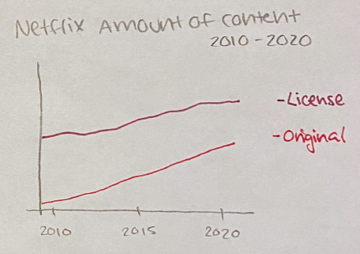

# Final Project: **Part 1**

## Project Outline:

### The rise of streaming services

#### Introduction:
 
 - **The beginning of streaming services and their moderate success:**
      
      Explain how streaming services started and introduce some of the main reasons for their initial growth
      
 - **The increasing amount of content:**
      
      Bring focus on how the mix of their original content with access to classic movies and tv shows became a key reason for their progress
        
#### Point 1: **Succes for streaming platforms**
    
 - **Exponential success & Covid-19**
        
   Original content in every platform and a new approach to TV shows. How the pandemic accelerated their growth in the last year and its projection for the future.
        
 - **Quality entertainment for the users**
        
   Content primarily for streaming services has higher scores than network and cable tv. The streaming services develop shows specifically for their users.
        
#### Point 2: **The other side of the coin**
    
  - **Overpopulation of streaming services**

    Big companies and important networks are now moving to stream services. This implies fees, multiple accounts, and way more targeted ads.
    
 - **Data acquisition**

    Streaming services have bigger access to your individual data and it links directly with the ads or fees they charge.
        
#### Closing: **What can we do?**
    
   Using this in our favor. Being selective with the content we consume.
   Support shows and networks that aline to our views and create quality content. 
        
## Initial Sketches:

   **Netflix amount of content 2010 - 2020           |              Streaming platform growth 2010 - 2020**
   
                         
   
   **Average scores for streaming services content         |       Old & new streaming services**
   
                           
   
  **Data acquisition per streaming service chart**
   
   
 
## The data: 
I'm planning to use multiple data sets to back up my project. Some of these datasets already exist, some I want to add extra information, and some I want to create (because they don't include a lot of information, they should be simple to make).
Some of the datasets I want to use:
 - [Estimated number of SVoD subscribers worldwide in 2020 and 2026, by service](https://www.statista.com/statistics/1052770/global-svod-subscriber-count-by-platform/)
My goal with this dataset is to bring attention to the current subscribers of each of the platforms and how the projections estimate their growth in the next years. This helps understand that the streaming services will definitely be the new way to watch content online and how people will embrace them even more in the coming years.
 - [Number of original content titles produced by Netflix worldwide from 2012 to 2019](https://www.statista.com/statistics/883491/netflix-original-content-titles/)
Because this data is not public, I'm planning to create my own dataset of this information. That way I can show how there has been an increase in the production of original content and which are the genres they are investing the most in. I will use this [Wikipedia's chart](https://en.wikipedia.org/wiki/List_of_Netflix_original_programming) as a base and edit the chart to work for the data visualization I want to create. 
 - [Which streaming service has the best original shows and movies?](https://www.allconnect.com/blog/ranking-best-original-content-streaming)
This dataset helps show how the quality of the content compares between each of the streaming services, and it could help some viewers decide in which of the streaming services they want to invest. I want to add an extra column to this dataset where I show the average rating for network content, that way I can also create a comparison between streaming services and cable/network content.
 - **Extra** Create a data set of multiple streaming services and classify them between payments or ads. This will also help the viewer understand which streaming services are free (but include ads at the middle of the content), and which ones have a fee to use (but free of ads). 

   
## Final Project Deliverable:

For this project, I'm planning to use the suggested method in class Shorthand. By using an interactive website, people can have proper access to the information and the data visualizations. This will also allow them to keep learning about the topic and consult extra sources.

I will focus on creating a narrative that explores the rise of streaming services. I will include plenty of data visualizations to provide the necessary information on the perks and cons of these services. This project will persuade viewers into being more selective on the content they consume and could help them decide which are the best ones for them to subscribe to.  

To get all the information I want as a backup, I will add and create a couple of datasets that will support my information. I decided to do this because currently these datasets are not public or are missing information that could be really useful to have.

  
